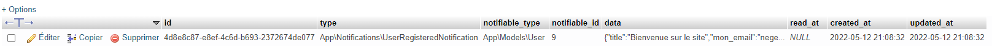

#  Laravel 9 - Les notifications

## <b>Lien de la doc : https://laravel.com/docs/9.x/notification </b>

Nous allons voir dans cette partie, les notifications de laravel.


## Notification classique
Afin de générer une notification, nous allons utiliser la commande 

    php artisan make:notification UserRegisteredNotification

Nous avons donc un fichier nommé ```RegisteredUserNotification.php``` dans le dossier ```app/Notifications```.

Pour utiliser un model dans un notification, il faut que ce dernier est le ``` use Notifiable; ``` dans le fichier.

Nous allons essayer d'envoyer une notification à l'utilisateur lorsque celui-ci s'enregistre.
Pour cela, on se rend dans le fichier ``` App\Http\Controllers\Auth\RegisterController.php ``` et on ajoute la ligne suivante arès la ligne qui déclenche un évènement :

    $user->notify(new UserRegisteredNotification());

On peut également passer une ou plusieurs variable en paramètres : 

    $post = ['titre'=>'Bienvenue sur le site','message'=>'Votre compte a été créé avec succès. Vous pouvez maintenant vous connecter.'];
    $user->notify(new UserRegisteredNotification($user, $post));

On se rend maintenant dans le fichier ```UserRegisteredNotification.php``` et on ajoute deux attributs ```post``` et ```user``` et on initialise les deux attributs dans le constructeur :

    public $post; 
    public $user;
    /**
     * Create a new notification instance.
     *
     * @return void
     */
    public function __construct($user, $post)
    {
        $this->user = $user;
        $this->post = $post;
    }

Et dans la méthode toMail(), on a : 
    
    public function toMail($notifiable)
    {
        return (new MailMessage)
                    ->line($this->post['titre'] . $notifiable->name . $this->post['message'])
                    ->action('Se connecter', url('/login'))
                    ->line('');
    }

On peut remplacer MailMessage par une autre classe mailable

On crée notre classe mailable, ```TestNotificationMail.php``` :

    <?php

    ...

    class TestNotificationMail extends Mailable
    {
        use Queueable, SerializesModels;
        public $post; 
        public $user;
        /**
        * Create a new message instance.
        *
        * @return void
        */
        public function __construct($user, $post)
        {
            $this->user = $user;
            $this->post = $post;
        }

        /**
        * Build the message.
        *
        * @return $this
        */
        public function build()
        {
            return $this->view('emails.test-notification-mail');
        }
    }

Lorsqu'on remplace notre MailMessage pas par une autre classe mailable, on appelle le contructeur de cette dernière en lui passant les paramètres que l'on souhaite. 
Dans notre cas, voici le constructeur de TestNotificationMail :

    public function toMail($notifiable)
    {
        return (new TestNotificationMail($notifiable, $this->post))
            ->to($notifiable->email);
    }

## Notifications sauvegardés en base de données

Afin d'utiliser les notifications sauvegardés en base de données, il nous faut des tables dans notre base de données, pour cela, nous allons executé la commande suivante : 

    php artisan notifications:table

En enregistrer une notification en base de données, il suffit de rajouter l'attribut ```database```, dans notre méthode via() :

    public function via($notifiable)
    {
        return ['mail', 'database'];
    }

Ce qui va automatiquement appelé la méthode ```toArray()``` de notre classe, et dans celle-ci, nous ajoutons : 

    public function toArray($notifiable)
    {
        return [
            'title' => $this->post['titre'],
            'mon_email' => $notifiable->email,
        ];
    }

Et lorsque l'on s'inscrit désormais, on a non seulement un mail qui est envoyé, mais aussi une notification en base de données.



Le champ ```notifiable_id``` est le champ qui va contenir l'id de l'utilisateur qui va recevoir la notification.

Et pour afficher toutes les notifications d'un utilisateur en particulier, nous faisons dans notre ```dashboard.blade.php```: 

    @foreach (auth()->user()->notifications as $notification)
        {{ $notification->data['mon_email'] }}
        @if($notification->read_at == null)
            <span class="text-red-500">(non lu)</span>
        @endif
    @endforeach

Afficher le nombre de notifications : 

    auth()->user()->notifications()->count()

Nous pouvons aussi voir les notifications non lues : 

    auth()->user()->unreadNotifications()->count()

Afin de définir qu'une notification est lue, nous faisons :

    $notification->markAsRead();

Nous avons aborder que certains points de la gestion des notifications, en effet, il nous reste encore les notifications par sms, etc.
La doc est ton ami !